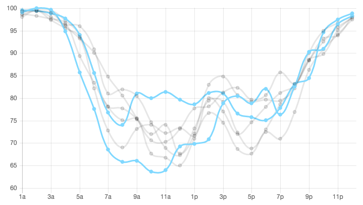

##Analyzing Binghamton Laundry data
Binghamton uses [Esuds](http://binghamton-asi.esuds.net/RoomStatus/showRoomStatus.i?locationId=6788) to show laundry availability, but it doesn't show any trends over time. I scraped data for several months and made a quick visualization in [chart.js](https://github.com/nnnick/Chart.js).

View the [interactive chart](http://laundry.jackfischer.me/)

